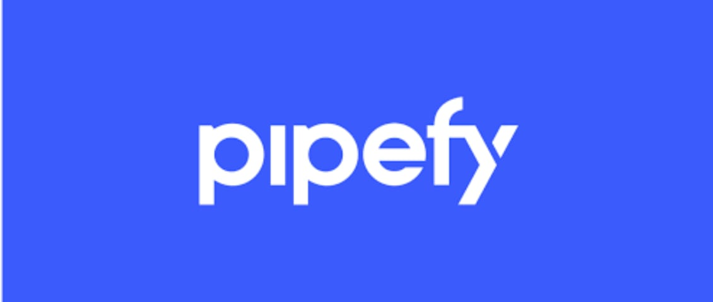
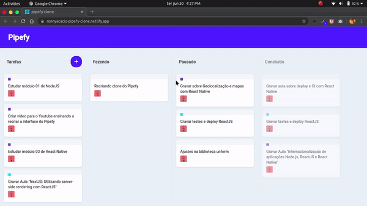

<h1 align="center">
  
</h1>

  

  

  

  

  

  

 

## 💻 Projeto

Esse projeto foi feito para treinar a minha habilidade de criação de UI's com ReactJS e CSS, foi escolhido o pipefy por conta do seu recurso drag'n drop, sendo assim seria muito produtivo realizar esse clone! Acesse aqui [Pipefy-clone](#)

 

## 🌐 Preview

<h1 align="center">
    
</h1>

## 🚀 Tecnologias

Esse projeto foi desenvolvido com as seguintes tecnologias:

- [React](https://reactjs.org)
- [Styled Components](https://styled-components.com/)
- [React Dnd](https://react-dnd.github.io/react-dnd/about)

 

## 🔨 Deploy Netlify

 

  Made with 💙 by <a href="https://www.linkedin.com/in/ronnyacacio/"> Ronny Acácio </a>

